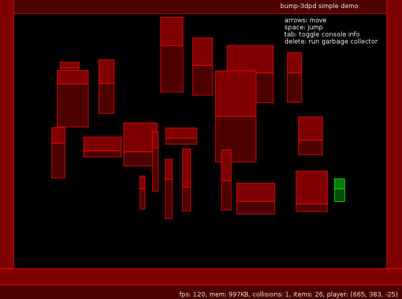
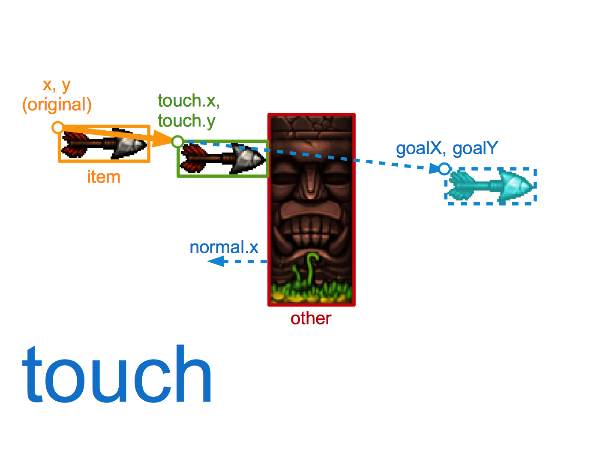
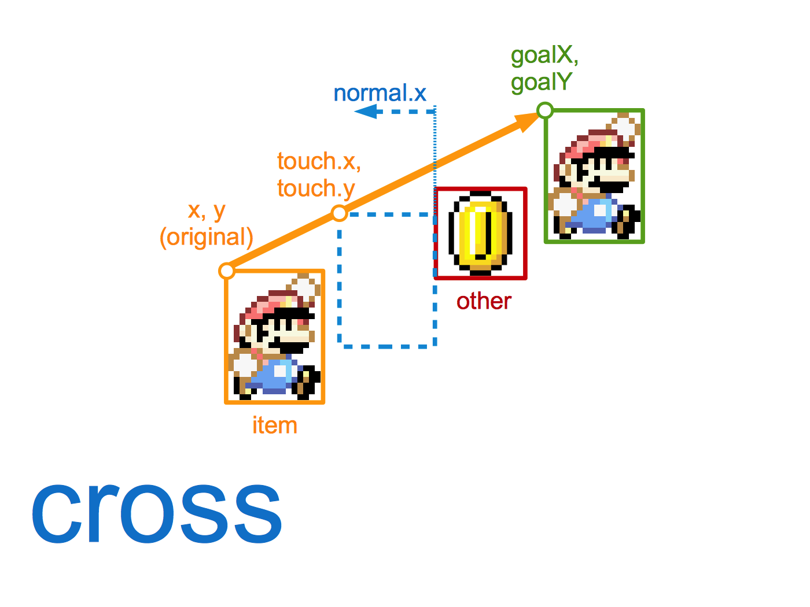
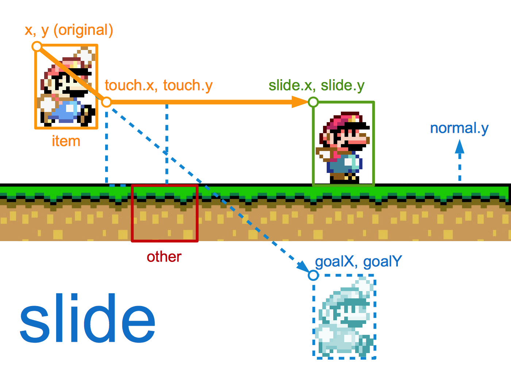
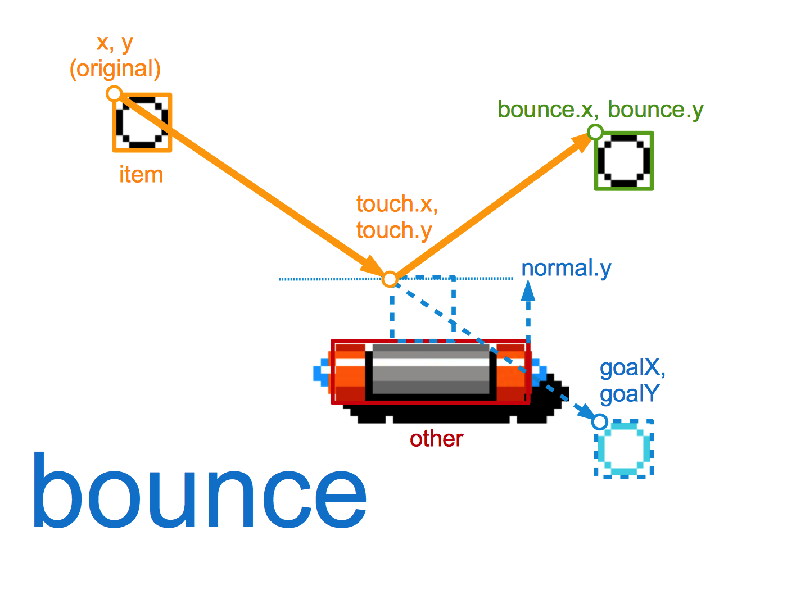

# bump-3dpd

[](https://travis-ci.org/oniietzschan/bump-3dpd)
[](https://codecov.io/gh/oniietzschan/bump-3dpd)


bump-3dpd is a Lua three-dimensional collision-detection library for axis-aligned cubes. It is based off of [kikito's bump.lua library](https://github.com/kikito/bump.lua). Its main features are:

* bump-3dpd only does axis-aligned bounding-box (AABB) collisions. If you need anything more complicated than that (spheres, meshes, etc.) then you're out of luck, pal.
* Handles tunnelling - all items are treated as "bullets". The fact that we only use AABBs allows doing this fast.
* Strives to be fast while being economic in memory
* It's centered on *detection*, but it also offers some (minimal & basic) *collision response*
* Can also return the items that touch a point, a segment or a cubic zone.
* bump-3dpd is _gameistic_ instead of realistic.

The demos are LÖVE based, but this library can be used in any Lua-compatible environment.

`bump-3dpd` is ideal for:

* 2.5D tile-based games, and games where most entities can be represented as axis-aligned cubes.
* Games which require some physics, but not a full realistic simulation - like a platformer.
* Examples of genres: beat 'em up (Battle Circuit), action-adventure (Zelder), 3D platformer (Knack).

`bump-3dpd` is not a good match for:

* Games that require polygons for the collision detection
* Games that require highly realistic simulations of physics - things "stacking up", "rolling over slides", etc.
* Games that require very fast objects colliding reallistically against each other (in bump, being _gameistic_, objects are moved and collided _one at a time_)
* Simulations where the order in which the collisions are resolved isn't known.

## Example

```lua

local bump = require 'bump-3dpd'

-- The grid cell size can be specified via the initialize method
-- By default, the cell size is 64
local world = bump.newWorld(50)

-- create two cubes
local A = {name="A"}
local B = {name="B"}

-- insert both cubes into bump
world:add(A, 0,    0, 0, 64, 256, 64) -- x, y, z, width, height, depth
world:add(B, 0, -100, 0, 32,  32, 32)

-- Try to move B to 0,64,0. If it collides with A, "slide over it"
local actualX, actualY, cols, len = world:move(B, 0, 64, 0)

-- prints "Attempted to move to 0,64,0 but ended up in 0,-32,0 due to 1 collisions"
if len > 0 then
  print(("Attempted to move to 0,64,0 but ended up in %d,%d,%d due to %d collisions"):format(actualX, actualY, actualZ, len))
else
  print("Moved B to 0, 64, 0 without collisions")
end

-- prints the new coordinates of B: 0, -32, 0, 32, 32, 32
print(world:getCube(B))

-- prints "Collision with A"
for i = 1, len do -- If more than one simultaneous collision, they are sorted out by proximity
  local col = cols[i]
  print(("Collision with %s."):format(col.other.name))
end

-- remove A and B from the world
world:remove(A)
world:remove(B)
```

## Demo

There is a demo showing movement, collision detection, basic slide-based resolution, and z-sorting in `main.lua`. You will need [LÖVE](http://love2d.org) in order to try it.



## Basic API - Adding, removing and moving items

### Requiring the library

``` lua
local bump = require 'bump-3dpd'
```

The following methods (`bump.newWorld`, `world:add`, `world:remove`, `world:update`, `world:move` & `world:check`) are *basic* for
working with bump-3dpd, as well as the 4 collision responses. If you want to use bump-3dpd effectively, you will need to understand at least
these.

### Creating a world

``` lua
local world = bump.newWorld(cellSize)
```

The first thing to do with bump-3dpd is creating a world. That is done with `bump.newWorld`.

* `cellSize`. Is an optional number. It defaults to 64. It represents the size of the sides
  of the (equilateral) cells that will be used internally to provide the data. In tile based games, it's usually a multiple of
  the tile side size. So in a game where tiles are 32x32x32, `cellSize` will be 32, 64 or 128. In more sparse games, it can be
  higher.

Don't worry too much about `cellSize` at the beginning, you can tweak it later on to see if bigger/smaller numbers
give you better results (you can't change the value of cellSize in runtime, but you can create as many worlds as you want,
each one with a different cellsize, if the need arises.)

The rest of the methods we have are for the worlds that we create.

### Adding items to the world

``` lua
world:add(item, x, y, z, w, h, d)
```

`world:add` is what you need to insert a new item in a world. "Items" are "anything that matters to your collision". It can be the player character,
a tile, a missile etc. In fact, you can insert items that don't participate in the collision at all - like puffs of smoke or background tiles. This
can be handy if you want to use the bump-3dpd world as a spatial database in addition to a collision detector (see the "queries section" below for mode details).

Each `item` will have an associated "cube" in the `world`.

* `item` is the new item being inserted (usually a table representing a game object, like `player` or `ground_tile`).
* `x, y, z, w, h, d`: the bounding-cube associated with `item` in the world. They are all mandatory. `x`, `y`, and `z` are the coordinates of the cube's position in space. `w`, `h`, `d` are the "width", and "height", and "depth" of the cube.

`world:add` returns no values. It generates no collisions - you can call `world:check(item)` if you want to get the collisions it creates right after it's added.

If you try to add an item to a world that already contains it, you will get an error.

### Removing items from the world

``` lua
world:remove(item)
```

bump-3dpd stores *hard references* to any items that you add (with `world:add`). If you decide that a item is no longer necessary, in addition to removing it
from your "entity list", you must also remove it from the world using `world:remove`. Otherwise it will still be there, and other objects might still collide
with it.

* `item` must be something previously inserted in the world with `world:add`. If this is not the case, `world:remove` will raise an error.

Once removed from the world, the item will stop existing in that world. It won't trigger any collisions with other objects any more. Attempting to move it
with `world:move` or checking collisions with `world:check` will raise an error.

It is ok to remove an object from the world and later add it again. In fact, some bump-3dpd methods do this internally.

This method returns nothing.

### Changing the position and dimensions of items in the world

``` lua
world:update(item, x, y, z, <w>, <h>, <d>)
```

Even if your "player" has attributes like `player.x`, `player.y`, and `player.z`, changing those will not automatically change them inside `world`. `update` is one of the ways to do so: it changes the cube representing `item` inside `world`.

* `item` must be something previously inserted in the world with `world:add`. Otherwise, `world:update` will raise an error.
* `x, y, z, w, h, d` the new dimensions of `item`. `x`, `y`, and `z` are mandatory. `w`, `h`, and `d` will default to the values the world already had for `item`.

This method always changes the cube associated to `item`, ignoring all collisions (use `world:move` for that). It returns nothing.

You may use `world:update` if you want to "teleport" your items around. A lot of time, however, you want to move them taking collisions into account.
In order to do that, you have `world:move`.


### Moving an item in the world, with collision resolution

``` lua
local actualX, actualY, actualZ, cols, len = world:move(item, goalX, goalY, goalZ, <filter>)
```

This is probably the most useful method of bump-3dpd. It moves the item inside the world towards a desired position, but taking collisions into account.

* `item` must be something previously inserted in the world with `world:add`. Otherwise, `world:move` will raise an error.
* `goalX, goalY, goalZ` are the *desired* `x`, `y`, and `z` coordinates. The item will end up in those coordinates if it doesn't collide with anything.
  If, however, it collides with 1 or more other items, it can end up in a different set of coordinates.
* `filter` is an optional function. If provided, it must have this signature: `local type = filter(item, other)`. By default, `filter` always returns `"slide"`.
  * `item` is the item being moved (the same one passed to `world:move` on the first param)
  * `other` is an item (different from `item`) which can collide with `item`.
  * `type` is a value which defines how `item` collides with `other`.
    * If `type` is `false` or `nil`, `item` will ignore `other` completely (there will be no collision)
    * If `type` is `"touch"`, `"cross"`, `"slide"` or `"bounce"`, `item` will respond to the collisions in different ways (explained below)
    * Any other value (unless handled in an advanced way) will provoke an error

* `actualX, actualY, actualZ` are the coordinates where the object ended up after colliding with other objects in the world while trying to get to `goalX, goalY, goalZ`. They can be equal to `goalX, goalY, goalZ` if, for example, no collisions happened.
* `len` is the amount of collisions produced. It is equivalent to `#cols`
* `cols` is an array of all the collisions that were detected. Each collision is a table. The most important item in that table is `cols[i].other`, which
  points to the item that collided with `item`. A full description of what's inside of each collision can be found on the "Advanced API" section.

The usual way you would use move is: calculate a "desirable" `goalX, goalY, goalZ` point for an item (maybe using its velocity), pass it to move, and then use `actualX, actualY, actualZ`
as the real "updates" - . For example, here's how a player would move:

``` lua
function player:move(dt)
  local goalX = self.x + self.xVelocity * dt
  local goalY = self.y + self.yVelocity * dt
  local goalZ = self.z + self.zVelocity * dt
  local actualX, actualY, actualZ, cols, len = world:move(self, goalX, goalY, goalZ)
  self.x, self.y, self.z = actualX, actualY, actualZ
  -- deal with the collisions
  for i = 1, len do
    print('collided with ' .. tostring(cols[i].other))
  end
end
```

Notice that if `filter` returns `nil` or `false`, it is guaranteed that `other` will not produce a collision. But the opposite is not true: it is possible that `filter` returns
`"slide"`, and yet no collision is produced. This is because `filter` is applied to *all the neighbors of `item`*, that is, all the items that "touch" the same cells as item. Some
of them might be on the same cells, but still not collide with item..

#### Collision Resolution

For each of the collisions returned by `world:move`, the most interesting attribute is `cols[i].other`. Often it's enough with it - for example if `item`
is one of those bullets that disappear when impacting the player you must make the bullet disappear (and decrease the player's health).

`world:move()` returns a list (instead of a single collision element) because in some cases you might want to "skip" some
collisions, or react to several of them in a single frame.

For example, imagine a player which collides on the same frame with a coin first, an enemy fireball, and the floor.

* since `cols[1].other` will be a coin, you will want to make the coin disappear (maybe with a sound) and increase the player's score.
* `cols[2].other` will be a fireball, so you will want to decrease the player's health and make the fireball disappear.
* `cols[3].other` will be a ground tile, so you will need to stop the player from "falling down", and maybe align it with the ground.

The first two can be handled just by using `col.other`, but "aligning the player with the ground" requires *collision resolution*.

bump-3dpd comes with 4 built-in ways to handle collisions: `touch`, `cross`, `slide` & `bounce`. You can select which one is used on each collision by returning
their name in the `filter` param of `world:move` or `world:check`. You can also choose to ignore a collision by returning `nil` or `false`.



This is the type of collision for things like arrows or bullets; things that "gets stuck" on their targets.

Collisions of this type have their `type` attribute set to `"touch"` and don't have any additional information apart from the the default one, shared by all collisions (see below).



This type of collision is for cases where you want to detect a collision but you don't want any response. It is useful for things like: detecting that the player has entered a new area,
or consumables (i.e. coins) which usually don't affect the player's trajectory, but it's still useful to know then they are collided with.

Collisions of this type have their `type` attribute set to `"cross"` and don't have any additional information apart from the the default one, shared by all collisions (see below).



This is the default collision type used in bump-3dpd. It's what you want to use for solid objects which "slide over other objects", like Super Mario does over a platform or the ground.

Collisions of this type have their `type` attribute set to `"slide"`. They also have a special attribute called `col.slide`, which is a 3d vector with three components: `col.slide.x`, `col.slide.y`, & `col.slide.z`. It represents the x, y, and z coordinates to which the `item` "attempted to slide to". They are different from `actualX`, `actualY`, & `actualZ` since other collisions later on can modify them.



A good example of this behavior is Arkanoid's ball; you can use this type of collision for things that "move away" after touching others.

Collisions of this type have their `type` attribute set to `"bounce"`. They also have a special attributes called `col.bounce`. It is a 3d vector which represents the x, y, and z
coordinates to which the `item` "attempted to bounce".

Here's an example of a filter displaying all these behaviors:

```lua
local playerFilter = function(item, other)
  if     other.isCoin   then return 'cross'
  elseif other.isWall   then return 'slide'
  elseif other.isExit   then return 'touch'
  elseif other.isSpring then return 'bounce'
  end
  -- else return nil
end
```

The code above will make a character work more or less like super-mario, collision-wise. It'll go though coins, collide with walls, bounce over springs, etc, ignoring things it should
not collide with like clouds in the background.

You could then use the collisions returned like so:

``` lua
function player:move(dt)
  local goalX = self.x + self.xVelocity * dt
  local goalY = self.y + self.yVelocity * dt
  local goalZ = self.z + self.zVelocity * dt
  local actualX, actualY, actualZ, cols, len = world:move(self, goalX, goalY, goalZ, playerFilter)
  self.x, self.y, self.z = actualX, actualY, actualZ
  for i = 1, len do
    local other = cols[i].other
    if other.isCoin then
      takeCoin(other)
    elseif other.isExit then
      changeLevel()
    elseif other.isSpring then
      self:highJump()
    end
  end
end
```

### Checking for collisions without moving

``` lua
local actualX, actualY, actualZ, cols, len = world:check(item, goalX, goalY, goalZ, <filter>)
```

It returns the position where `item` would end up, and the collisions it would encounter, should it attempt to move to `goalX, goalY, goalZ` with the specified `filter`.

Notice that `check` has the same parameters and return values as `move`. The difference is that the former does not update the position of `item` in the world - you
would have to call `world:update` in order to do that. In fact, `world:move` is implemented by calling `world:check` first, and then `world:update` immediately after.

The equivalent code to the previous example using `check` would be:

``` lua
function player:move(dt)
  local goalX = self.x + self.xVelocity * dt
  local goalY = self.y + self.yVelocity * dt
  local goalZ = self.z + self.zVelocity * dt
  local actualX, actualY, actualZ, cols, len = world:check(self, goalX, goalY, goalZ, playerFilter)
  world:update(self, actualX, actualY, actualZ) -- update the player's cube in the world
  self.x, self.y, self.z = actualX, actualY, actualZ
  -- ... <deal with the collisions as before>
end
```

`world:check` is useful for things like "planing in advance" or "studying alternatives", when moving is still not fully decided.


### Collision info

Here's the info contained on every collision item contained in the `cols` variables mentioned above:

```lua
cols[i] = {
  item  = the item being moved / checked
  other = an item colliding with the item being moved
  type  = the result of `filter(other)`. It's usually "touch", "cross", "slide" or "bounce"
  overlaps  = boolean. True if item "was overlapping" other when the collision started.
              False if it didn't but "tunneled" through other
  ti        = Number between 0 and 1. How far along the movement to the goal did the collision occur
  move      = Vector({x=number,y=number,z=number}). The difference between the original
              coordinates and the actual ones.
  normal    = Vector({x=number,y=number,z=number}). The collision normal; usually -1, 0, or 1
              in x, y, and z.
  touch     = Vector({x=number,y=number,z=number}). The coordinates where item started touching other
  itemCube  = The cube item occupied when the touch happened({x=N, y=N, z=N, w=N, h=N, d=N})
  otherCube = The cube other occupied when the touch happened({x=N, y=N, z=N, w=N, h=N, d=N})
}
```

Note that collisions of type `slide` and `bounce` have some additional fields. They are described
on each response's section above.

Most of this info is useful only if you are doing semi-advanced stuff with collisions, but they could have some uses.

For example, `cols[i].normal` could be used to "detect if a player is on ground or not". `cols[i].touch` could be used to
"spawn a puff of dust when a player touches ground after a fall", and so on.

## Intermediate API - Querying the world

The following methods are required for basic usage of bump-3dpd, but are quite handy, and you would be missing out some nice features of this lib if you were not using it.

Sometimes it is desirable to know "which items are in a certain area". This is called "querying the world".

Bump-3dpd allows querying the world via a point, a cubic zone, and a straight line segment.

This makes it useful not only as a collision detection library, but also as a lightweight spatial dictionary. In particular,
you can use bump-3dpd to "only draw the things that are needed" on the screen. In order to do this, you would have to add all your
"visible" objects into bump-3dpd, even if they don't collide with anything (this is usually ok, just ignore them with your filters when
you do the collisions).

### Querying with a point

``` lua
local items, len = world:queryPoint(x, y, z, filter)
```
Returns the items that touch a given point.

It is useful for things like clicking with the mouse and getting the items affected.

* `x, y, z` are the coordinates of the point that is being checked
* `items` is the list items from the ones inserted on the world (like `player`) that contain the point `x, y, z`. If no items touch the point, then `items` will be an empty table. If not empty, then the order of these items is random.
* `filter` is an optional function. It takes one parameter (an item). `queryPoint` will not return the items that return
  `false` or `nil` on `filter(item)`. By default, all items touched by the point are returned.
* `len` is the length of the items list. It is equivalent to `#items`, but it's slightly faster to use `len` instead.

### Querying with a cube

``` lua
local items, len = world:queryCube(x, y, z, w, h, d, filter)
```
Returns the items that touch a given cube.

Useful for things like selecting what to display on the screen, as mentioned above, or selecting a group of units with the mouse in a strategy game.

* `x, y, z, w, h, d` is a cube. The items that intersect with it will be returned.
* `filter` is an optional function. When provided, it is used to "filter out" which items are returned - if `filter(item)` returns `false` or `nil`, that item is ignored. By default, all items are included.
* `items` is a list of items, like in `world:queryPoint`.
* `len` is equivalent to `#items`

### Querying with a segment

``` lua
local items, len = world:querySegment(x1, y1, z1, x2, y2, z2, filter)
```
Returns the items that touch a segment.

It's useful for things like line-of-sight or modelling bullets or lasers.

* `x1, y1, z1, x2, y2, z2` are the start and end coordinates of the segment.
* `filter` is an optional function. When provided, it is used to "filter out" which items are returned - if `filter(item)` returns `false` or `nil`, that item is ignored. By default, all items are included.
* `items` is a list of items, similar to `world:queryPoint`, intersecting with the given segment. The difference is that in `world:querySegment` the items are sorted by proximity. The ones closest to `x1, y1, z1` appear first, while the ones farther away appear later.
* `len` is equivalent to `#items`.

### Querying with a segment (with more detailed info) (NOTE: UNAVAILABLE RIGHT NOW)

``` lua
local itemInfo, len = world:querySegmentWithCoords(x1, y1, z1, x2, y2, z2)
```
An extended version of `world:querySegment` which returns the collision points of the segment with the items,
in addition to the items.

It is useful if you need to **actually show** the lasers/bullets or if you need to show some impact effects (i.e. spawning some particles
where a bullet hits a wall). If you don't need the actual points of contact between the segment and the bounding cubes, use
`world:querySegment`, since it's faster.

* `x1, y1, z1, x2, y2, z2, filter` same as in `world:querySegment`
* `itemInfo` is a list of tables. Each element in the table has the following elements: `item`, `x1`, `y1`, `z1`, `x2`, `y2`, `z2`, `t0`, and `t1`.
  * `info.item` is the item being intersected by the segment.
  * `info.x1, info.y1, info.z1` are the coordinates of the first intersection between `item` and the segment.
  * `info.x2, info.y2, info.z2` are the coordinates of the second intersection between `item` and the segment.
  * `info.ti1` & `info.ti2` are numbers between 0 and 1 which say "how far from the starting point of the segment did the impact happen".
* `len` is equivalent to `#itemInfo`.

Most people will only need `info.item`, `info.x1`, `info.y1`, and `info.y1`. However, `info.x2`, `info.y2`, and `info.z2` are useful if you also need to show "the exit point of a bullet", for example. `info.ti1` and `info.ti2` give an idea about the distance to the origin, so they can be used for things like calculating the intensity of a shooting that becomes weaker with distance.


## Advanced API

The following methods are advanced and/or used internally by the library; most people will not need them.

``` lua
local result = world:hasItem(item)
```
Returns wether the world contains the given item or not. This function does not throw an error if `item` is not included in `world`; it just returns `false`.

``` lua
local count = world:countItems()
```
Returns the number of items inserted in the world. Useful for debugging

``` lua
local items, len = world:getItems()
```
Builds and returns an array containing all the items in the world (as well as its length). This can be useful if you want to draw or update all the items in the world, without
doing any queries. Notice that in which the items will be returned is non-deterministic.

``` lua
local x, y, z, w, h, d = world:getCube(item)
```
Given an item, obtain the coordinates of its bounding cube. Useful for debugging/testing things.

``` lua
local cell_count = world:countCells()
```

Returns the number of cells being used. Useful for testing/debugging.

``` lua
local cx, cy, cz = world:toCell(x, y, z)
```

Given a point, return the coordinates of the cell that containg it using the world's `cellSize`. Useful mostly for debugging bump-3dpd, or drawing
debug info.

``` lua
local x, y, z = world:toWorld(cx, cy, cz)
```

The inverse of `world:toCell`. Given the coordinates of a cell, return the coordinates of its main corner in the game world.

``` lua
local cols, len = world:project(item, x, y, z, w, h, d, goalX, goalY, goalZ, filter)
```

Moves a the given imaginary cube towards goalX, goalY, and goalZ, providing a list of collisions as they happen *in that straight path*.

This method might be useful when implementing your own new collision responses, although it could be also used as a query method.

```lua
local actualX,actualY,actualZ, cols, len = world:projectMove(item, x,y,z,w,h,d, goalX,goalY,goalZ, filter)
```

Similar to `world:project()`, except that it simulates collision responses as the cube tries to move along it's path. This is probably most useful for optimization, since it allows you to have items which move appropriately through your world without actually adding them to the world itself.

```lua
bump.responses.touch
bump.responses.cross
bump.responses.slide
bump.responses.bounce
```

These are the functions bump-3dpd uses to resolve collisions by default. You can use these functions' source as a base to build your own response function, if you feel adventurous.

```lua
world:addResponse(name, response)
```

This is how you register a new type of response in the world. All worlds come with the 4 pre-defined responses already installed, but you can add your own: if you register the response `'foo'`, if your filter returns `'foo'` in a collision your world will handle it with `response`. This, however, is advanced stuff, and you will have to read the source code of the default responses in order to know how to do that.

```lua
bump.cube.getNearestCorner
bump.cube.getSegmentIntersectionIndices
bump.cube.getDiff
bump.cube.containsPoint
bump.cube.isIntersecting
bump.cube.getCubeDistance
bump.cube.detectCollision
```

bump-3dpd comes with some cube-related functions in the `bump.cube` namespace. These are **not** part of the official API and can change at any moment. However, feel free to
use them if you are implementing your own collision responses.

## Installation

Just copy the `bump-3dpd.lua` file wherever you want it. Then require it where you need it:

``` lua
local bump = require 'bump-3dpd'
```

If you copied `bump-3dpd.lua` to a file not accesible from the root folder (for example a lib folder), change the code accordingly:

``` lua
local bump = require 'lib.bump-3dpd'
```

## License

bump-3dpd is licensed under the MIT license.

## Specs

Specs for this project can be run using [busted](http://olivinelabs.com/busted).

## Changelog

See CHANGELOG.md for details

## Todo

* Implement `world:querySegmentWithCoords()`.
* Empty planes and rows should be removed from world.cells as part of garbage collection.
